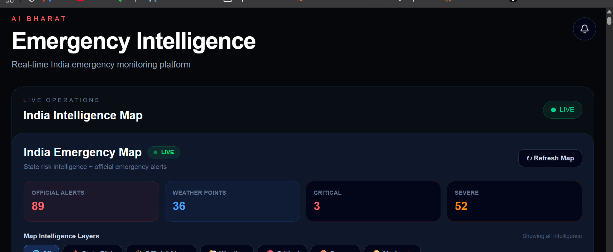
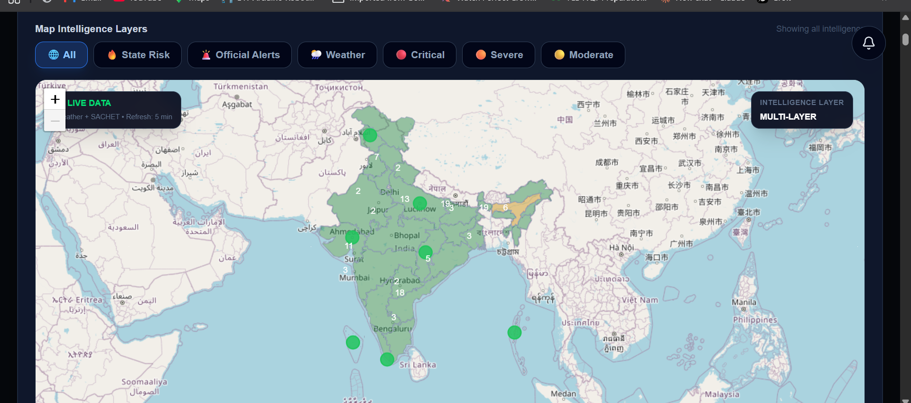
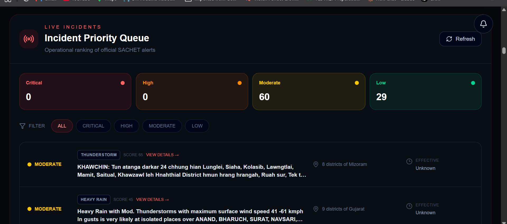

# 🇮🇳 AI Bharat Emergency Intelligence

### Real-Time Emergency Intelligence & Geospatial Command Center for India

[](https://nextjs.org/)
[](https://www.typescriptlang.org/)
[](https://vercel.com/)
[](https://ai-bharat-emergency-intelligence.vercel.app/)

🌐 **Live Demo:** https://ai-bharat-emergency-intelligence.vercel.app/

---

## 🖥️ Dashboard Preview

### 🇮🇳 Emergency Intelligence Dashboard



### 🗺️ India Emergency Map



### 🚨 Incident Priority Queue



---

AI Bharat Emergency Intelligence is a production-ready emergency intelligence dashboard designed to combine **official disaster alerts, live weather intelligence, geospatial visualization, risk analysis, and incident prioritization** into a single command-center interface for India.

---

## 🚨 What This Project Does

The platform provides a unified view of emergency intelligence across India by combining:

- 🇮🇳 India-wide geospatial visualization
- 🚨 Official NDMA SACHET alerts
- 🌦️ Live weather intelligence
- 🧠 Rule-based emergency risk analysis
- 📊 Historical emergency analytics
- 🔎 Incident priority queue
- 🗺️ Map-to-incident drill-down
- 📈 Emergency correlations
- ❤️ System health monitoring
- 🔔 New-alert notification center
- ⚡ Production caching and optimized APIs

---

## ✨ Key Features

### 🗺️ Geospatial Emergency Command Center

- Interactive India map
- State-level weather intelligence
- Emergency alert visualization
- Risk-level visualization
- Map filtering
- Incident focusing
- Marker clustering
- Incident drill-down

### 🚨 Official Emergency Alerts

Official disaster alerts are retrieved from:

**NDMA SACHET**

The dashboard keeps official alerts separate from internally calculated weather-risk signals.

### 🌦️ Live Weather Intelligence

Weather information includes:

- Temperature
- Feels-like temperature
- Humidity
- Precipitation
- Wind speed
- Wind gusts
- Weather conditions

Weather data is used to generate analytical risk signals.

### 🧠 AI Emergency Analyst

The Emergency Analyst evaluates available alert and weather signals to prioritize states requiring attention.

The system considers factors such as:

- Extreme temperatures
- Heavy precipitation
- High winds
- Severe weather
- Hazard types
- Emergency language
- Alert severity

> Risk scores are analytical indicators and are not official government warnings.

### 🚨 Incident Priority Queue

Incidents can be ranked according to their calculated priority.

Operators can:

- Review high-priority incidents
- Inspect incident details
- Focus incidents on the map
- Analyze contributing signals

### 🔗 Map ↔ Incident Intelligence

The dashboard connects the incident queue with the geographical map.

Selecting an incident can focus the corresponding location on the map.

### 📊 Historical Analytics

Historical intelligence provides analytical views for:

- Emergency patterns
- Risk trends
- State-level activity
- Alert distribution
- Historical comparisons

### 🔎 Emergency Correlation Engine

The correlation engine combines:

**Official alerts + weather signals**

to identify potentially significant combinations such as:

- Flood + heavy rain
- Storm + high wind
- Heat + extreme temperature
- High-severity official alerts

### ❤️ System Health

The system includes API health monitoring for critical services.

Monitored components include:

- Alerts API
- Weather API
- Analyst API
- Correlation API

### 🔔 Alert Notification Center

The dashboard automatically checks for newly available official alerts and surfaces new activity to the operator.

---

## 🏗️ Architecture

```text
                    ┌──────────────────────┐
                    │   Next.js Dashboard  │
                    └──────────┬───────────┘
                               │
              ┌────────────────┼────────────────┐
              │                │                │
              ▼                ▼                ▼
        NDMA SACHET       Open-Meteo       Intelligence
        Official Alerts   Weather Data       APIs
              │                │                │
              └────────────────┼────────────────┘
                               ▼
                    ┌──────────────────────┐
                    │ Risk & Correlation   │
                    │ Intelligence Engine  │
                    └──────────┬───────────┘
                               ▼
                    ┌──────────────────────┐
                    │ Geospatial Command   │
                    │ Center / Analytics   │
                    └──────────────────────┘
